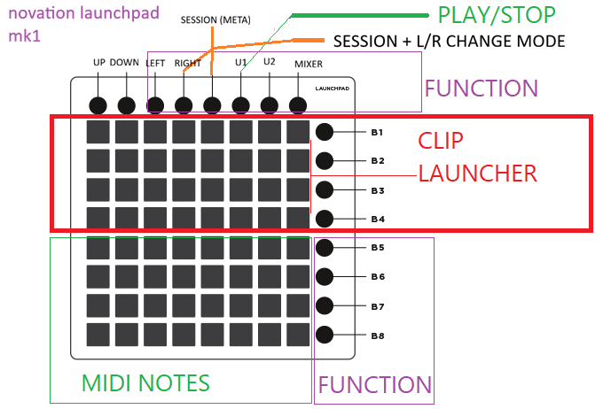

# Novation Launchpad MK1 Script V3

Custom Live Looping Setup - 2026-07-28

Warren's Launchpad V3 Script (Launchpad Mk1 / Mini / S) — focused on clip recording, keys, and guitar looping rather than being a full DrivenByMoss-style replacement.   SESSION (aka Meta)+Left Arrow/Right Arrow and User1,User2,Mixer are the mode switching controls.

Controller name in Bitwig: **Novation → Launchpad Split MK1 WP**

Layout reminder:

```
  * * * * * * * *     <- top row: up, down, left, right, session, user1, user2, mixer
  x x x x x x x x >   <- 8x8 pad grid + scene/launch column (>)
  x x x x x x x x >
  ...
```

# Split Layout



(Details below)
## Modifier keys (top row)


| Button  | Role                                     |
| ------- | ---------------------------------------- |
| SESSION | **META** — hold for alternate functions  |
| USER1   | Play/Stop (on Grid); also used in combos |
| USER2   | **MODE** — hold for alternate functions  |
| MIXER   | **SHIFT** — hold for alternate functions |


Physical labels help a lot; one button often has three jobs.

## Navigating major pages (modes)

Hold **META (SESSION)** and press:

- **LEFT** → previous page
- **RIGHT** → next page

Page order (cycles):

1. **Clip Launcher** (Grid) — default on startup
2. **Keys / Drums** — full-pad note layouts
3. **Step Sequencer** — edit notes in the focused clip
4. **Mixer** — track volume / pan / device / CC faders
5. **Switches (CC)** — momentary/toggle MIDI CCs from the pads
6. **Browse Presets** — device browser categories / results

Bitwig shows a popup with the page title when you change pages.

---

1. Clip Launcher (Grid)

---

8 scenes (rows) × 8 tracks (columns). Best matched to Bitwig’s **Mix** perspective (scenes as rows).

### Top row (Grid)


| Button  | Alone           | +SHIFT                           | +META                 |
| ------- | --------------- | -------------------------------- | --------------------- |
| UP      | Scene bank up   |                                  |                       |
| DOWN    | Scene bank down |                                  |                       |
| LEFT    | Previous track  | Track/grid bank adjust           | Previous page         |
| RIGHT   | Next track      | Track/grid bank adjust           | Next page             |
| SESSION | Hold = META     |                                  |                       |
| USER1   | Play / Stop     | Musical fade-stop (when playing) | **Toggle split mode** |
| USER2   | Hold = MODE     |                                  |                       |
| MIXER   | Hold = SHIFT    |                                  |                       |


### Split Grid + Keys (`META + USER1`)

Toggles a **4-row clip launcher** on top and a **4×8 note/CC pad** on the bottom. Not a full 8×8 keyboard — for that, use the Keys page (below).

### Scene column (right side) on Grid

- Alone: launch scene for that row  
- **+SHIFT**: undo / redo / zoom in / zoom out / zoom to fit / zoom to selection  
- **+MODE**: clip automation write, metronome, arranger loop, mixer, note editor, looper length modes  
- **+META**: browser, inspector, arrange / mix / edit perspectives, devices, clip overdub, pre-roll metronome


### Clip pad combos (Grid)

- Pad alone: launch / record / stop clip (context-dependent)  
- **META + pad**: delete / clear clip  
- **SHIFT + pad**: duplicate clip

---

1. Keys / Drums (full pad keyboard)

---

Enter with **META + RIGHT** from Grid (or keep cycling until the popup says **Keys / Drums**).

On entry the layout resets to **Piano**. Use the **scene column** (right-side round buttons, top → bottom) to pick a note map:


| Scene # (top→bottom) | Alone                                          | +SHIFT                 |
| -------------------- | ---------------------------------------------- | ---------------------- |
| 1                    | **Piano** (default)                            |                        |
| 2                    | **Drums (large)**                              |                        |
| 3                    | **Diatonic** (scale/root)                      | **Linear** grid        |
| 4                    | **Push**-style in-scale grid                   | **Full 8×8 chromatic** |
| 5                    | Velocity step 1                                |                        |
| 6                    | Velocity step 2 **and** **Full 8×8 chromatic** |                        |
| 7                    | Velocity step 3 **and** Drums (small)          |                        |
| 8                    | Velocity step 4                                |                        |


Popup shows `Scale: …` when a map is selected.

### Full 8×8 keyboard mode

This is the chromatic map named **Drums (small#2)** in code: every pad is a consecutive MIDI note (`36 + x + 8*y`), all 64 pads lit as keys.

**How to get there:**

1. Go to **Keys / Drums** (`META + RIGHT` from Clip Launcher).
2. Hold **SHIFT (MIXER)** and press **scene button 4** (fourth from the top).
  - Alternate: press **scene button 6** (also selects the same map, and bumps velocity).

Octave / root / mode scrolling:

- **UP / DOWN** → octave shift (`rootKey ± 12`; popup shows the new root). On the 8×8 chromatic map, SHIFT+UP/DOWN jumps by 16.  
- **SHIFT + LEFT / RIGHT** → note-map horizontal scroll (root note / scale mode on Diatonic & Push; switches among Linear / drum layouts where those maps support it).

---

1. Step Sequencer

---

Edit note steps in the focused clip (works best on short 1–2 bar clips). Uses the active note map for the key side of the UI. Scene buttons pick step size / velocity steps.

---

1. Mixer

---

Column “faders” for:

- Track volume  
- MIDI CC  
- Device quick controls  
- Track pan

**SHIFT + scene buttons 1–4** select those submodes. **USER1** still follows Grid play/stop behaviour via shared handling.

---

1. Switches (CC)

---

Whole pad grid as MIDI CC transmitters (start CC around 14). Useful for mapping toggles / momentary controls outside the note path.

---

1. Browse Presets

---

Pad UI over the device browser (smart categories, categories, tags, results). **USER1** accepts / closes selection when something is chosen.

---


## Design notes

- Quirky combo-heavy script for live keys/guitar looping, not a complete Launchpad Pro replacement.  
- **Active page is persisted** via Bitwig Preferences (`Controllers` → this script → **Launchpad WP → Active Page**). Changing page with META+LEFT/RIGHT saves it; next script load / Bitwig restart restores it.  
- Leaving and re-entering **Keys / Drums** still resets the note map to **Piano** — reselect 8×8 with **SHIFT + scene 4** if you need it again.


## Derivation

Based on [https://github.com/TVbene/LaunchpadScriptV3](https://github.com/TVbene/LaunchpadScriptV3)  
which was based on [https://github.com/dplduffy/LaunchpadScriptV3](https://github.com/dplduffy/LaunchpadScriptV3)  

Also borrows ideas from:  
[https://github.com/wpostma/bitwig_scripts/blob/master/Controller%20Scripts/yamaha_mx49_mx61/Yamaha-MX49-MX61.control.js](https://github.com/wpostma/bitwig_scripts/blob/master/Controller%20Scripts/yamaha_mx49_mx61/Yamaha-MX49-MX61.control.js)  

Newer versions (if maintained): [https://github.com/wpostma/LaunchpadScriptV3](https://github.com/wpostma/LaunchpadScriptV3)
